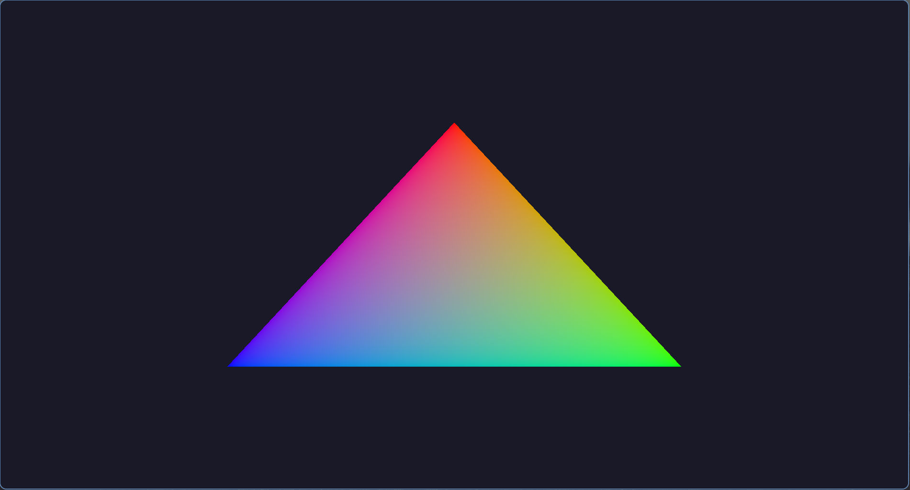

# RenderLib 

A library that abstracts Vulkan, simplifying its use and providing reasonable defaults for common setup and rendering tasks.

## Requirements
 
- Linux 
- Wayland 
- `slangc`
- GLFW
- GLM

## Building

`build.sh` builds the library and example projects, and compiles and symlinks example assets into the build directory.

```bash
./build.sh
```

## Examples

### Hello Triangle


Renders a colorful triangle.

Covers: window creation, geometry configuration, pipeline creation.

### Hello Sphere
<video src="./docs/assets/hello-sphere-video.mp4"></video>

Renders a moving, textured sphere.

Covers: depth buffers, uniform buffers, textures, descriptor layouts/sets, push constants.

### Suzanne Scatter
<video src="./docs/assets/suzanne-scatter-video.mp4"></video>

Renders 25,000 instances of Suzanne with randomized positions and rotations via GPU instancing.

Covers: storage buffers, GPU instancing.
